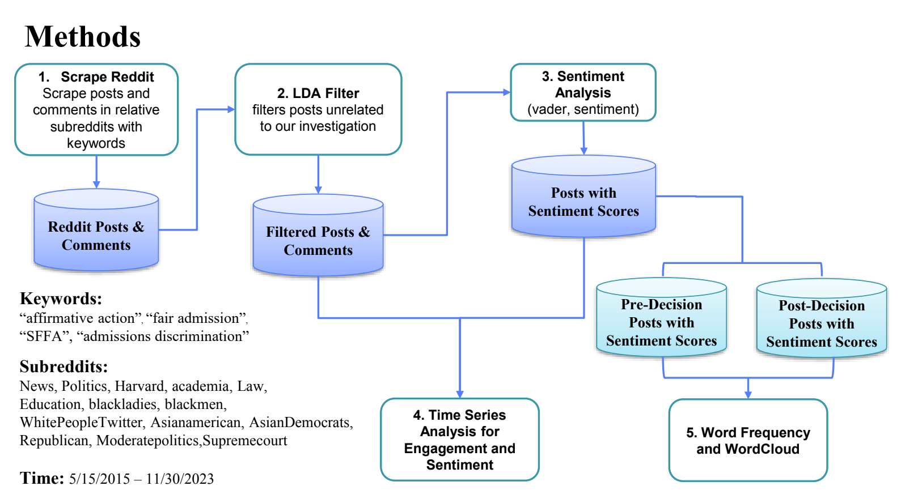
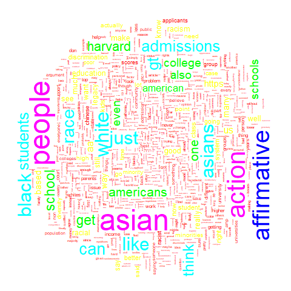
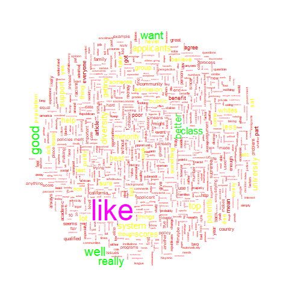
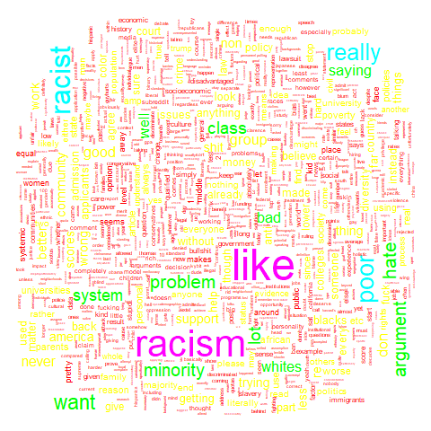

```{r setup, include=FALSE, tidy=TRUE}
knitr::opts_chunk$set(echo=TRUE,cache=TRUE, 
                      autodep=TRUE, cache.comments=FALSE,
                      message=FALSE, warning=FALSE)
```

```{r, message = FALSE, warning = FALSE, include=FALSE}
# load packages
library(xml2)
library(rmarkdown)
library(pandoc)
library(rvest)
library(tidyverse)
library(jsonlite)
library(robotstxt)
library(RSocrata)
library(dplyr)
library(tidytext)
library(tm)
library(RedditExtractoR)
library(stringr)
library(magrittr)
library(ggpubr)
library(zoo)
library(xts)
library(quanteda)
library(SentimentAnalysis)
library(vader)
library(GGally)
library(magrittr)
library(dplyr)
library(knitr)
library(wordcloud)
library(tidytext)
library(tm)
library(RColorBrewer)
library(dplyr)
library(png)
```

```{r, include = FALSE}
posts <- read.csv("../data/selected_posts.csv", 
                     header = TRUE, 
                     # sep = ";", 
                     encoding = "UTF-8") %>% distinct()
```

```{r, include = FALSE}
# load comments

comments <- read.csv("../data/scraped_comments_by_selected_posts.csv", 
                     header = TRUE, 
                     # sep = ";", 
                     encoding = "UTF-8") %>% distinct()

text_comments <- comments %>% dplyr::select(date,comment,url)

irrelevantWords <- c("[deleted]","[removed]")

filtered_comments <- text_comments %>% filter(comment != "[deleted]" & comment != "[removed]")
```

```{r, include = FALSE}
# load sm
sentiments <- read.csv("../data/sentiments.csv", 
                     header = TRUE, 
                     # sep = ";", 
                     encoding = "UTF-8")
```

```{r, include = FALSE}
all_comments <- read.csv("../data/comments/all_comments.csv",
# all_comments <- read.csv("data/all_comments.csv", 
                     header = TRUE, 
                     # sep = ";", 
                     encoding = "UTF-8")

all_comments$date <- as.Date(all_comments$date)

irrelevantWords <- c("[deleted]","[removed]")

filtered_all_comments <- all_comments %>% filter(comment != "[deleted]" & comment != "[removed]")
```

# Abstract

This study investigates public sentiment and discourse on Reddit regarding the landmark Supreme Court decision in Students for Fair Admissions v. Harvard, which ruled race-based affirmative action in college admissions unconstitutional. Our research aims to understand the impact of this decision on public opinion, particularly among Reddit users. The study focuses on three key questions: (1) Did the Supreme Court's decision incite increased discussion about race-based affirmative action among Reddit users? (2) How did public sentiment change over this period, particularly before and after the Supreme Court's decision? (3) What specific topics dominated these discussions? To answer these questions, we collected data from Reddit comments, employed the Latent Dirichlet Allocation (LDA) model for content filtering and sentiment analysis, supplemented by time series analysis to track sentiment changes. We also analyzed word frequencies to understand the focus of discussions. Our findings indicate a noticeable increase in discussions about affirmative action on Reddit following the Supreme Court decision. The overall sentiment trended negatively over time, suggesting growing public disapproval of affirmative action policies on the platform. Word frequency calculations reveal "Asian" as a predominant focus in the debate, with differing emotional tones in discussions about different racial groups.\

**GitHub Link**: <https://github.com/krliu67/Final-Project_727.git/>

# Introduction

Students for Fair Admissions v. Harvard is a landmark decision of the Supreme Court of the United States, in which the court determined that race-based affirmative action in college admissions violates the Fourteenth Amendment's Equal Protection Clause on 29th June, 2023 [@Toternberg2023]. This ruling barred all public and private colleges from considering race in admissions decisions, significantly changing the landscape of affirmative action in higher education, reflecting the deep divide and ongoing controversy over these policies. The case began in 2013 when Students for Fair Admissions (SFFA) filed a lawsuit against Harvard University. SFFA claimed that Harvard's admissions practices violated Title VI of the Civil Rights Act of 1964 by discriminating against Asian Americans​. In 2017, under the Trump administration, the Department of Justice opened an investigation into the allegations against Harvard's policies​. The case reached the Supreme Court, and on June 29, 2023, the Supreme Court issued a decision by a vote of 6-2 that reversed the lower court's ruling and held that affirmative action in college admissions is unconstitutional[@Chamberlain2023].

The debated focus in this case is "affirmative action", which has long been a controversial and often poorly understood policy[@Crosby2006]. Affirmative action refers to policies that support members of disadvantaged groups that have previously suffered discrimination in areas such as education and employment. In the United States, affirmative action typically involves measures to improve the opportunities for historically excluded groups, particularly racial minorities, which can include setting goals for inclusion, outreach efforts, and in some cases, considering race or gender as one factor in university admissions or hiring processes[@Rubenfeld1997]. The concept is controversial for several reasons. Firstly, critics argue that it can undermine the principles of meritocracy and fairness, as it may give less qualified candidates an advantage over more qualified candidates due to their race or gender. It can also lead to reverse discrimination, where members of a majority group feel they are being unfairly discriminated against in favor of minority groups. Besides, there is a concern that affirmative action can stigmatize beneficiaries, making it seem that they cannot succeed without special treatment, which can be detrimental to their self-esteem and societal views of their capabilities[@Skrentny2018]. Further, the debate often centers around whether the focus should be on equality of opportunity (not discriminating and allowing everyone an equal chance) or equality of outcome (actively working to ensure that groups that have been historically disadvantaged are represented proportionally)[@Fryer2005].

Therefore, studying public opinion towards Students for Fair Admissions v. Harvard, particularly the Supreme Court's decision, is of paramount importance. It offers a comprehensive perspective on the attitudes of various stakeholders towards the policy. This analysis can hopefully reflect the role that the policy plays in contemporary American society, and yield insights for policy implications.

Specifically, we aim to answer: (1) Did the Supreme Court's decision trigger increased discussions among Reddit users about race-based affirmative action in college admissions? (2) How did people's sentimental tendencies change during that period (especially, would this trend shift before and after the announcement of the Supreme Court's decision)? (3) What topics are of interest to these discussions? This research hopes to get insight into the above questions through the lens of social media with the aid of sentiment analysis. In the following section, we will specify the data sources and data gathering process.

# Methodology

## Data source

We collected Reddit comments posted before and after the Supreme Court decision leak (5/15/2015 - 11/30/2023), focusing on those containing keywords relevant to this topic, such as "affirmative action" "fair admission" "SFFA" and "admission discrimination". Our search will be specifically targeted at certain subreddits. This approach is due to the difficulty in accurately identifying our intended content through a broad, site-wide search. To address potential representative biases that might arise from limiting our search to specific subreddits, we have intentionally chosen a diverse range of subreddits, including those named after various races and representing both major political parties, ensuring considerable heterogeneity in our data.

## Analysis techniques

To access the public opinion, we resorted to Reddit, which is one of the most popular websites in the United States over the years. At the time of writing, Reddit is the 3rd most popular website nationally. The prevalence of Reddit suggests a wealth of data and the potential for capturing a broad range of views. Additionally, the platform's anonymity encourages users to share their true thoughts without concern for social approval. Furthermore, Reddit is more conducive to research than other well-known social networks such as Facebook and Twitter, due to its provision of readily accessible data at no cost.

We collected relevant data using RedditExtractoR API on R. Briefly, we use keywords "affirmative action" "fair admission" "SFFA" and "admission discrimination". Our search is specifically targeted at certain subreddits as listed in the graph that follows. This approach is due to the difficulty in accurately identifying our intended content through a broad, site-wide search. To address potential representative biases that might arise from limiting our search to specific subreddits, we intentionally chose a diverse range of subreddits, including those named after various races and representing both major political parties, ensuring considerable heterogeneity in our data.

We employ the Latent Dirichlet Allocation (LDA) model to filter posts unrelated to our investigation after initial data scraping. After this, we conducted sentiment analysis coupled with time series analysis to investigate changes in sentiment over time. We also organized the most commonly used words with wordcloud to depict word frequencies associated with different sentiments. Finally, we include a total of 14785 comments in our analysis. Our working flow is shown in the \@ref(fig:fig1).

```{r, echo = FALSE, label='fig1',fig.cap="Flowchart", out.width="520px", fig.align='center'}

```

The LDA model successfully identified 30 prominent topics. These topics were characterized by distinct sets of keywords above. Below are examples of topics listed by LDA model that were strongly associated with our goal.

```{r, echo=FALSE}
# allTopicNames
df_LDA_topics <- read.csv("allTopicNames.csv", header = TRUE, encoding = "UTF-8")
colnames(df_LDA_topics) <- c("topic_number","topic")
# kable(df_LDA_topics, caption = "allTopicNames")
# choose 2,3,4,5,6,8,12,13,14,16,19,20,22,23,24
df_LDA_topics_filtered <- df_LDA_topics[c(2,3,4,5,6,8,12,13,14,16,19,20,22,23,24),]
kable(df_LDA_topics_filtered, caption = "LDA-Filtered Topics",row.names = FALSE)
```

# Results

## Analysis

### Reddit Engagement Trend Over Time

```{r, echo=FALSE, label='fig2',fig.cap="Number of Comments", fig.align='center', fig.width=9}
# q1 plot
start_date <- as.Date("2015-05-15")
end_date <- as.Date("2023-06-29")

before <-  filtered_all_comments[filtered_all_comments$date >= start_date & filtered_all_comments$date < end_date, ]
after <- filtered_all_comments[filtered_all_comments$date >= end_date, ]

before_count <- before %>% dplyr::group_by(date) %>%  dplyr::summarise(num = dplyr::n())
after_count <- after %>% dplyr::group_by(date) %>%  dplyr::summarise(num = dplyr::n())

y_limits <- range(c(after_count$num, before_count$num))

p1 <- ggplot(data = after_count, mapping = aes(x = date, y = num, group = 1)) +
  geom_line() +
  ylim(y_limits) +
  scale_x_date(date_breaks = "1 month", date_labels = "%Y-%m") + 
  xlab('Date after Decision') +
  ylab('Number of Comments')

p2 <- ggplot(data = before_count, mapping = aes(x = date, y = num, group = 1)) +
  geom_line() +
  ylim(y_limits) +
  scale_x_date(date_breaks = "2 years", date_labels = "%Y-%m") + 
  xlab('Date before Decision') +
  ylab('Number of Comments')

ggarrange(p2,p1,ncol=2,nrow=1)
```

We first calculated the number of posts before and after the decision of the Supreme Court, we can see a steep increase in the engagement in Reddit about relative topics after the decision date as expected. This feature shows in \@ref(fig:fig2). 

### Sentiment Trend Over Time

#### Vader

```{r,echo=FALSE, label='fig3',fig.cap="Rolling Mean of Time Series", fig.align='center', fig.width=9}
# q2 plot
vaders_date <- filtered_comments %>% dplyr::select(date,url)

vaders_date <- cbind(vaders_date,sentiments$Vader)

colnames(vaders_date) <- c("date","url","vader")

start_date <- as.Date("2015-05-15")
end_date <- as.Date("2023-06-29")

vaders_date <- vaders_date[vaders_date$date >= start_date, ]

vaders_by_date <- vaders_date %>%  dplyr::group_by(date) %>% dplyr::summarise(mean_vader = mean(vader)) %>% data.frame()
vaders_by_date$date <- as.Date(vaders_by_date$date)

start_date <- as.Date("2015-05-15")
end_date <- as.Date("2023-06-29")

vaders_by_date_before <- vaders_by_date[vaders_by_date$date >= start_date & vaders_by_date$date < end_date, ]

vaders_by_date_after <- vaders_by_date[vaders_by_date$date >= end_date, ]

ts_vaders_by_date_before <- xts(vaders_by_date_before$m, order.by = vaders_by_date_before$date)

rolling_mean_vaders_by_date_before <- rollapply(ts_vaders_by_date_before, width = 5, FUN = mean, by = 15, align = 'right', na.rm = TRUE) %>% na.omit()

df_vaders_by_date_before <- data.frame(date = zoo::index(rolling_mean_vaders_by_date_before), mean_value = coredata(rolling_mean_vaders_by_date_before))

df_vaders_by_date_before <- df_vaders_by_date_before %>% na.omit()


ts_vaders_by_date_after <- xts(vaders_by_date_after$m, order.by = vaders_by_date_after$date)

rolling_mean_vaders_by_date_after <- rollapply(ts_vaders_by_date_after, width = 3, FUN = mean, by = 3, align = 'right', na.rm = TRUE) %>% na.omit()

df_vaders_by_date_after <- data.frame(date = zoo::index(rolling_mean_vaders_by_date_after), mean_value = coredata(rolling_mean_vaders_by_date_after))

df_vaders_by_date_after <- df_vaders_by_date_after %>% na.omit()

y_limits <- range(c(df_vaders_by_date_after$mean_value, df_vaders_by_date_before$mean_value))

p3 <- ggplot(df_vaders_by_date_before, aes(x = date, y = mean_value)) +
  geom_line() +
  ylim(y_limits) +
  theme_minimal() +
  labs(title = "15-Day Rolling Mean of Time Series", x = "Date before Decision", y = "Mean Sentiment Scores")

p4 <- ggplot(df_vaders_by_date_after, aes(x = date, y = mean_value)) +
  geom_line() +
  ylim(y_limits) +
  theme_minimal() +
  labs(title = "3-Day Rolling Mean of Time Series", x = "Date after Decision", y = "Mean Sentiment Scores")

ggarrange(p3,p4,ncol=2,nrow=1)
```


We analyzed the sentiment trend by calculating vader sentiment score. we smoothed the day-by-day jitters by plotting the rolling means across a period of 15 days for the data before the decision in \@ref(fig:fig3), and a period of 3 days for the data after the decision to make the plot more readable. The plot shows that people's sentiment towards this incident fluctuates a lot before and after the decision.

In order to have a overview of the general trend statistically, we employed the Mann-Kendall trend test to examine whether there is a monotonic trend in the sentiment change over time. As is shown in the results, the Mann-Kendall trend test indicates a downward trend in the overall sentiment. This suggests that, over the entire period from 2015 to 2023, public sentiment on Reddit regarding affirmative action became more negative. Below is our Mann-Kendall trend test result.

```{r, echo=FALSE}
# MK-test table
df_MK<- data.frame(
  vader_tau <- c(-0.0623,-0.0381,-0.1170),
  vader_p <- c(0.0490,0.2861,0.3550)
  # afinn_tau <- c(0.0747,-0.0784,0.0091),
  # afinn_p <- c(0.0969,0.0135,0.8942)
)
# colnames(df_MK) <- c("vader_tau","vader_p","afinn_tau","afinn_p")
colnames(df_MK) <- c("vader_tau","vader_p")
row.names(df_MK) <- c("data_overall","data_before","data_after")
kable(df_MK, caption = "Mann-Kendall Trend Test by Vader",row.names = TRUE)
```

#### loughran


In order to get a more nuanced view of the public sentiment change, we further used the Loughran-McDonald Sentiment Word Lists. The Loughran-McDonald Sentiment Word Lists are often used in finance and accounting research to assess the tone of financial documents. Unlike typical sentiment analysis models that classify words into positive, negative, and neutral categories, the Loughran-McDonald lists were specifically designed to account for the context in which words are used in financial reports. The result shows in \@ref(fig:fig4).
\newpage
```{r, echo=FALSE,label='fig4', fig.cap="Loughran-McDonald Sentiment Word Lists", fig.align='center', fig.width=8}
textdata <- filtered_comments
df_tidy <- textdata %>%
  unnest_tokens(word, comment)

df_sentiment_loughran <- df_tidy %>%
  inner_join(get_sentiments("loughran"))

loughran_count <- df_sentiment_loughran %>%
  group_by(date, sentiment) %>%
  summarise(count = n()) %>%
  ungroup() 

loughran_count$date <- as.Date(loughran_count$date)
loughran_before <- loughran_count %>%
  filter(date < as.Date("2023-06-29") & date >= as.Date("2022-08-15") )
loughran_after <- loughran_count %>%
  filter(date >= as.Date("2023-06-29")& date < as.Date("2023-08-15"))

loughran_before_smoothed <- loughran_before %>%
  group_by(sentiment) %>%
  arrange(date) %>%
  mutate(rolling_mean = rollapply(count, width = 15, FUN = mean, partial = TRUE, align = 'right')) %>%
  ungroup()

loughran_after_smoothed <- loughran_after %>%
  group_by(sentiment) %>%
  arrange(date) %>%
  mutate(rolling_mean = rollapply(count, width = 3, FUN = mean, partial = TRUE, align = 'right')) %>%
  ungroup()

y_limits <- range(c(loughran_before_smoothed$count, loughran_after_smoothed$count))

LB <- ggplot(loughran_before_smoothed, aes(x=date, y=count, group=sentiment, color=sentiment)) +
  geom_line() +
  geom_point() + 
  labs(title="Sentiment Trends Over Time (loughran-Before)",
       x="Date",
       y="Number of Posts",
       color="Sentiment") +
  theme_minimal() + 
  theme(legend.position="bottom") +
  ylim(y_limits)

LA <- ggplot(loughran_after_smoothed , aes(x=date, y=count, group=sentiment, color=sentiment)) +
  geom_line() +
  geom_point() + 
  labs(title="Sentiment Trends Over Time (loughran-After)",
       x="Date",
       y="Number of Posts",
       color="Sentiment") +
  theme_minimal() + 
  theme(legend.position="bottom") +
  ylim(y_limits)
ggarrange(LB, LA,ncol=2,nrow=1)
```

The result correspond the the former one, as the plot shows a sharp increase in negative sentiment after the decision, and the overall count of positive comments is relatively low. Among the sub-category, we can see a relatively considerable percentage of *litigious* comments all across the time period, this reflects the controversial nature of the topic.

#### NRC

The NRC Emotion Lexicon, also known as EmoLex, provides another way of looking into the sentiment categories. It is a list of English words and their associations with eight basic emotions (anger, fear, anticipation, trust, surprise, sadness, joy, and disgust) and two sentiments (negative and positive) developed by Saif Mohammad and Peter Turney. The lexicon categorizes each word into these emotions and sentiments based on human annotations.

```{r, echo=FALSE,label='fig5', fig.cap="NRC Emotion Lexicon", fig.align='center', fig.height=4}

df_sentiment_nrc <- df_tidy %>%
  inner_join(get_sentiments("nrc"))

nrc_count <- df_sentiment_nrc %>%
  group_by(date, sentiment) %>%
  summarise(count = n()) %>%
  ungroup() 

nrc_count$date <- as.Date(nrc_count$date)
nrc_before <- nrc_count %>%
  filter(date < as.Date("2023-06-29") & date >= as.Date("2022-08-15") )
nrc_after <- nrc_count %>%
  filter(date >= as.Date("2023-06-29")& date < as.Date("2023-08-15"))

nrc_before_smoothed <- nrc_before %>%
  group_by(sentiment) %>%
  arrange(date) %>%
  mutate(rolling_mean = rollapply(count, width = 15, FUN = mean, partial = TRUE, align = 'right')) %>%
  ungroup()

nrc_after_smoothed <- nrc_after %>%
  group_by(sentiment) %>%
  arrange(date) %>%
  mutate(rolling_mean = rollapply(count, width = 3, FUN = mean, partial = TRUE, align = 'right')) %>%
  ungroup()

nrc_before_smoothed_pos<-nrc_before_smoothed %>%
  filter(sentiment=="positive" | sentiment=="joy" | sentiment=="anticipation" | sentiment=="trust" | sentiment=="surprise")
nrc_before_smoothed_neg<-nrc_before_smoothed %>%
  filter(sentiment=="negative" | sentiment=="anger" | sentiment=="disgust" | sentiment=="fear" | sentiment=="sadness")
nrc_after_smoothed_pos<-nrc_after_smoothed %>%
  filter(sentiment=="positive" | sentiment=="joy" | sentiment=="anticipation" | sentiment=="trust" | sentiment=="surprise")
nrc_after_smoothed_neg<-nrc_after_smoothed %>%
  filter(sentiment=="negative" | sentiment=="anger" | sentiment=="disgust" | sentiment=="fear" | sentiment=="sadness")

y_limits <- range(c(nrc_after_smoothed_neg$count,nrc_before_smoothed_neg$count,nrc_after_smoothed_pos$count, nrc_after_smoothed_neg$count))

NBP <- ggplot(nrc_before_smoothed_pos, aes(x=date, y=count, group=sentiment, color=sentiment)) +
  geom_line() +
  geom_point() + 
  labs(title="Positive Sentiment Trends Over Time (nrc-Before)",
       x="Date",
       y="Number of Posts",
       color="Sentiment") +
  theme_minimal() + 
  theme(legend.position="bottom")

NBN <- ggplot(nrc_before_smoothed_neg, aes(x=date, y=count, group=sentiment, color=sentiment)) +
  geom_line() +
  geom_point() + 
  labs(title="Negative Sentiment Trends Over Time (nrc-Before)",
       x="Date",
       y="Number of Posts",
       color="Sentiment") +
  theme_minimal() + 
  theme(legend.position="bottom")

NAP <- ggplot(nrc_after_smoothed_pos , aes(x=date, y=count, group=sentiment, color=sentiment)) +
  geom_line() +
  geom_point() + 
  labs(title="Positive Sentiment Trends Over Time (nrc-After)",
       x="Date",
       y="Number of Posts",
       color="Sentiment") +
  theme_minimal() + 
  theme(legend.position="bottom")

NAN <- ggplot(nrc_after_smoothed_neg , aes(x=date, y=count, group=sentiment, color=sentiment)) +
  geom_line() +
  geom_point() + 
  labs(title="Negative  Sentiment Trends Over Time (nrc-After)",
       x="Date",
       y="Number of Posts",
       color="Sentiment") +
  theme_minimal() + 
  theme(legend.position="bottom")

ggarrange(NBP,NAP,ncol=1,nrow=2)
```
```{r, echo=FALSE,label='fig6', fig.cap="NRC Emotion Lexicon", fig.align='center', fig.height=4}
ggarrange(NBN,NAN,ncol=1,nrow=2)
```

Observing \@ref(fig:fig5) and \@ref(fig:fig6), Both positive and negative comments came to a peak after the leak of the decision. This corresponds with the increased engagement revealed in our first step of analysis.

Looking at the trends of comments with positive sentiment, "trust" is the most noticeable component all across the period, followed by "anticipation". The condition is more complicated for comments with negative sentiment, "anger" "sadness" and "fear" seem to overlap with each other during this period.
\newpage

### Word Frequency by Sentiment

<!-- q3 wordcloud -->

```{r, echo=FALSE, label='fig7', fig.cap="WordCloud for all comments", out.width='180px', fig.align='center',out.height='180px'}

```

```{r, echo=FALSE, label='fig8', fig.cap="WordCloud for positive comments", out.width='180px', fig.align='center',out.height='180px'}

```

```{r, echo=FALSE, label='fig9', fig.cap="WordCloud for negative comments", out.width='180px', fig.align='center',out.height='180px'}

```

We then look into the most commonly used words in different sentiments, which are \@ref(fig:fig7), \@ref(fig:fig8) and \@ref(fig:fig9). The calculation of word frequency indicates the debate overall is focused on "Asian". There are nuanced differences between negative comments and positive posts, as "black" is a considerable component of comments with negative emotions. We further got a view of which words we might see more of if related words such as "asian", "american", and "affirmative", "action" are removed, since it seems these are being picked up the most due to the nature of the topic of discussion. We can see that among the comments related to negative feelings, racism is the dominant accusation.

# Conclusion and Discussion

In conclusion, \

1.  The decision of the Supreme Court might be the trigger of public engagement on Reddit about this topic.\
2.  Regarding the trend of attitude over time, we observed volatility in public sentiment on Reddit towards affirmative action during this period. This volatility might reflect the public's reaction to various events related to affirmative action during this period. This phenomenon also corresponds with existing studies, which revealed perceptions of affirmative action fluctuate substantially and in an irregular manner over time[@Ewoh1997][@Schuman1997]. The variability in support for affirmative action may be anticipated, considering the ambiguity and breadth of the concept, as well as the prevalent misunderstandings regarding its definition[@Crosby1996].\
3.  But the downward trend in the overall sentiment is also noteworthy, suggesting public sentiment on Reddit regarding affirmative action became more negative.\
4.  The calculation of word frequency indicates the debate overall is focused on "Asian". There are nuanced differences between negative comments and positive posts, as "black" is a considerable component of comments with negative emotions. After removing words used for searching, we can see racism is the dominant accusation among the comments related to negative feelings. \

There are many limitations of the current study. As mentioned above, we do not know how representative the subreddit sample was of the whole U.S. population. Therefore, we could not blindly generalize the findings to the whole United States. Also, the LDA model hasn't been trained to the utmost, so the current posts may still include some noises.

# References
